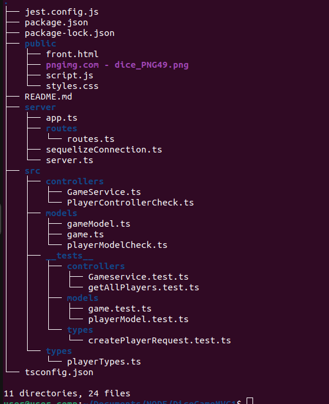

# DiceGame MVC

## About

This is a web application or API built using Node.js and the Express.js framework. It is based on MVC (Model View Controller.) The app presents a dice game.


## Getting Started

To get started with the application, follow these steps:

1. Clone the repository to your local machine.

2. Install the required dependencies by running the following command:

   ```bash
   npm install

3. Build the application using TypeScript by running:

   ```bash
   npm run build

- Access the front-end of the application at this url: http://localhost:3000/front.html


## Playing instructions:

1. Go to front.html. 
2. Create your player using the form. If the player is created correctly, a message will appear confirming it. 
3. Take the id of your created player. Type that id in the "Enter player's ID to get a player's games" field.
4. hit the "Roll dice!" button.

- There are 2 dice. You must get 7 to win, otherwise you lose.

The results of your game will appear on the screen.

Have fun!


### scripts

- Install the required dependencies by running the following command:

   ```bash
   npm run dev

- Application start

   ```bash
   npm start

- Tests

   ```bash
   npm test


## Routes and Postman

- Routes are defined in server/routes/routes.ts

Click on Postman to check the routes

[](https://god.gw.postman.com/run-collection/28879225-1a4ccfc6-a9ec-4398-beb8-3a576ae5434c?action=collection%2Ffork&source=rip_markdown&collection-url=entityId%3D28879225-1a4ccfc6-a9ec-4398-beb8-3a576ae5434c%26entityType%3Dcollection%26workspaceId%3D95d075ca-e1a3-4de4-8633-32a48a8e4f1d)


## Dependencies and devDependencies

- Check my [Title](package.json)


## Database

The app connects to the mySql database. The configuration of this connection can be found in ... We have used Sequelize for the ORM


## Folder structure


